## 🏗️ Architecture overview

* **Carbon router** - The core ingestion service that receives Solana blockchain data via Yellowstone gRPC, stores it in RocksDB, and publishes to Redpanda topics
* **Runtime engine** - Compiles Rust functions to WebAssembly, executes them efficiently, and manages function lifecycle with disk persistence  
* **Function server** - RESTful API layer that simplifies function deployment, management, and monitoring
* **Signal distribution** - Publishing system that delivers signals to UI clients and trading systems