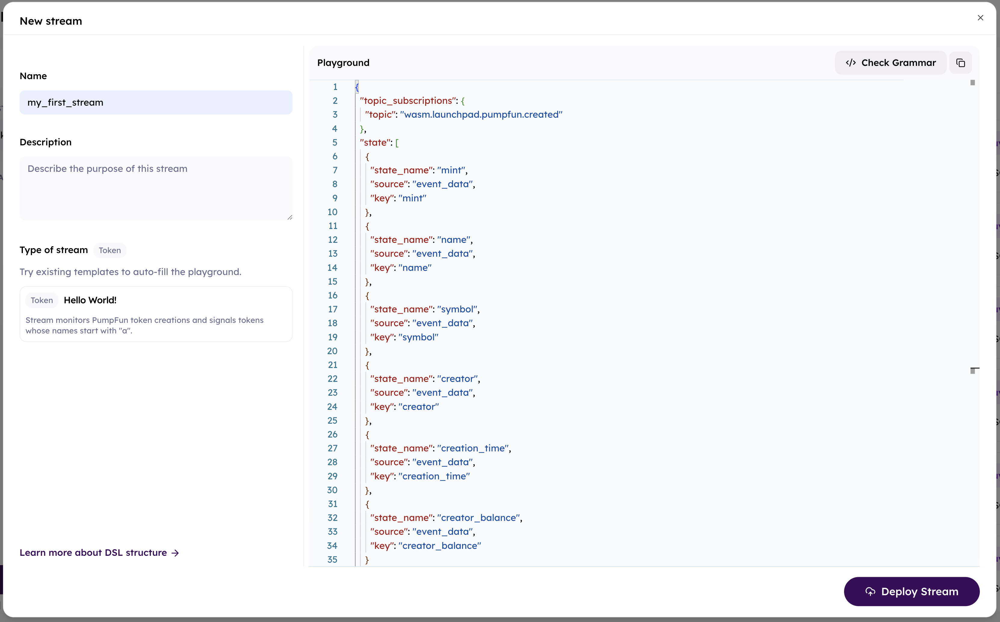
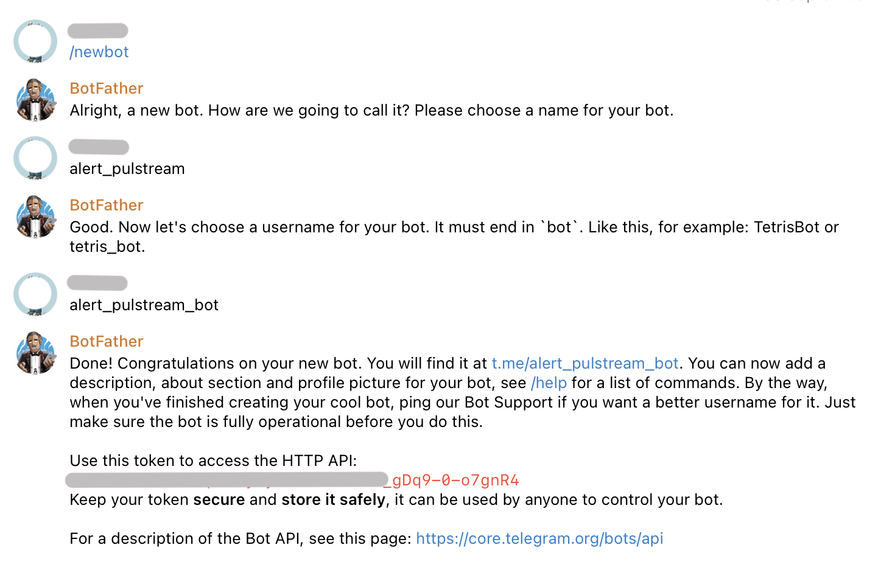
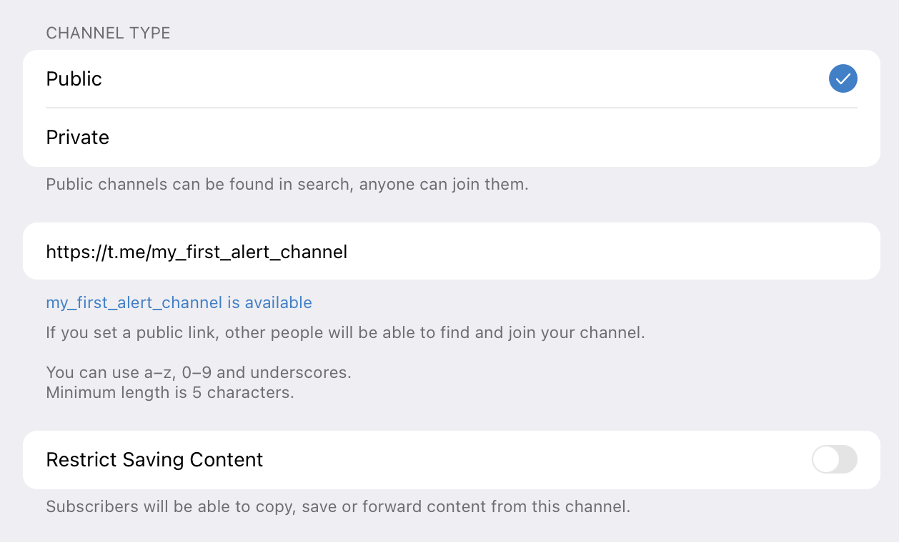
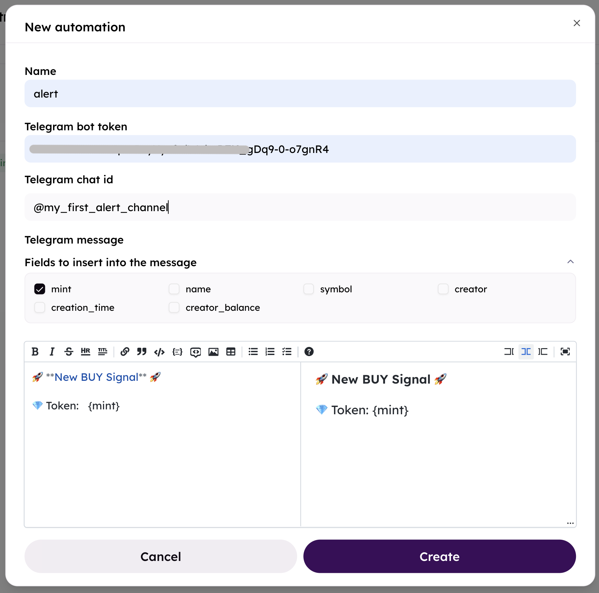

**What we do:**  
- Create a stream to track if a token named **PUMP** is created on Pumpfun.  
- Send a Telegram alert.  

### Step 1: Create a stream using JSON DSL  
- Go to Pulstream, and login using wallet
- Create a new stream
- Paste the JSON code to playground

```json
{
  "topic_subscriptions": {
    "topic": "wasm.launchpad.pumpfun.created"
  },
  "state": [
    {
      "state_name": "mint",
      "source": "event_data",
      "key": "mint"
    },
    {
      "state_name": "name",
      "source": "event_data",
      "key": "name"
    },
    {
      "state_name": "symbol",
      "source": "event_data",
      "key": "symbol"
    },
    {
      "state_name": "creator",
      "source": "event_data",
      "key": "creator"
    },
    {
      "state_name": "creation_time",
      "source": "event_data",
      "key": "creation_time"
    },
    {
      "state_name": "creator_balance",
      "source": "event_data",
      "key": "creator_balance"
    }
  ],
  "conditions": {
    "type": "all",
    "rules": [
      {
        "field": "name",
        "operator": "equal",
        "value": "PUMP"
      },
      {
        "field": "creator_balance",
        "operator": "greater_than",
        "value": 1
      }
    ]
  }
}
```

- Deploy stream



### Step 2: Create a Telegram bot and add it to a public channel

**Create a Telegram bot**

- Open a chat with **[@BotFather](https://t.me/BotFather)**  
- Use the `/newbot` command to create a new bot  
- Once created, **copy the bot token** provided  



**Add the bot to a public channel**

- Create or open the public channel you want to use  
- Go to **Channel Info → Administrators → Add Admin**  
- Search for your bot by its username (e.g., `@your_bot`)  
- Add the bot as an administrator and grant it the necessary permissions



**Alert configuration**

- Use the **bot token** and **public channel ID** from the previous step to configure the alert.  
- Define the **Telegram message template** with placeholders for dynamic fields (e.g., `{mint}`, `{name}`, `{symbol}`).

Example:
```
🚀 New BUY Signal 🚀
💎 Token: {mint}
📛 Name: {name}
🔤 Symbol: {symbol}
👤 Creator: {creator}
🕒 Created at: {creation_time}
```

