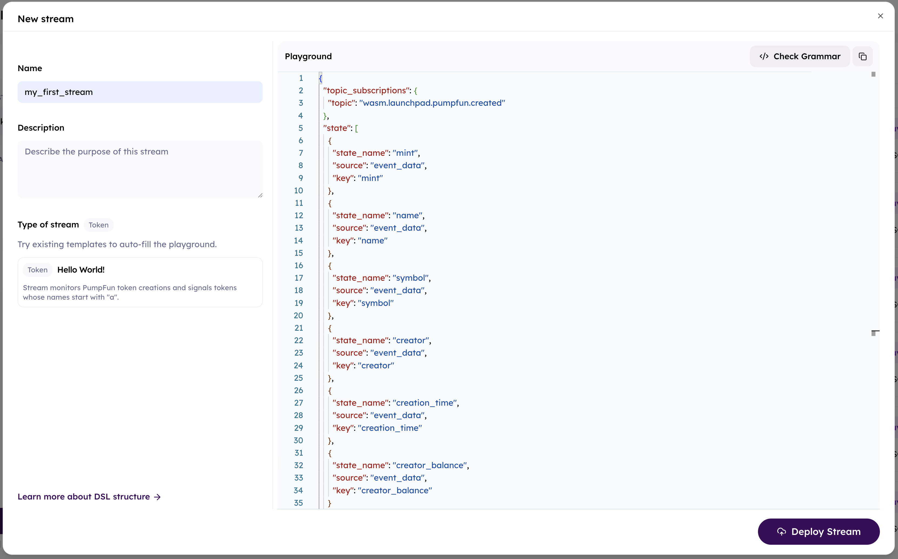

# Quick Start

## Token Snipe  

**What we do:**  
- Create a stream to track if a token named **PUMP** is created on Pumpfun.  
- Send a Telegram alert.  

## Steps  

### Step 1: Create a stream using JSON DSL  

### Step 2: Paste the code  

```json
{
  "topic_subscriptions": {
    "topic": "wasm.launchpad.pumpfun.created"
  },
  "state": [
    {
      "state_name": "mint",
      "source": "event_data",
      "key": "mint"
    },
    {
      "state_name": "name",
      "source": "event_data",
      "key": "name"
    },
    {
      "state_name": "symbol",
      "source": "event_data",
      "key": "symbol"
    },
    {
      "state_name": "creator",
      "source": "event_data",
      "key": "creator"
    },
    {
      "state_name": "creation_time",
      "source": "event_data",
      "key": "creation_time"
    },
    {
      "state_name": "creator_balance",
      "source": "event_data",
      "key": "creator_balance"
    }
  ],
  "conditions": {
    "type": "all",
    "rules": [
      {
        "field": "name",
        "operator": "equal",
        "value": "PUMP"
      },
      {
        "field": "creator_balance",
        "operator": "greater_than",
        "value": 1
      }
    ]
  }
}
```

### Step 3: Deploy stream



### Step 4: Create telegram alert